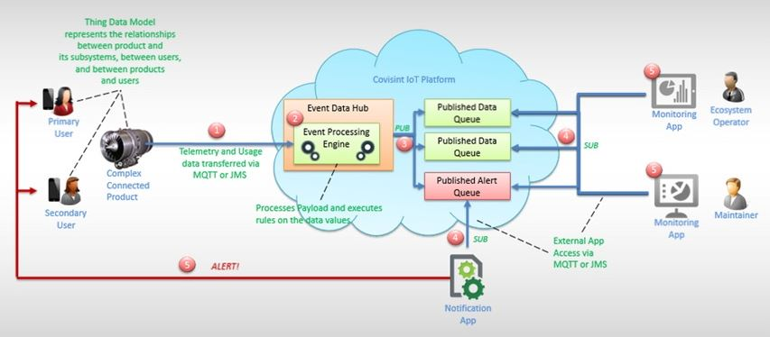

# IoT Platform Overview

This initial release of the Covisint Internet of Things Platform introduces features that support the fundamental IoT use case of monitoring the health of connected products. In this use case, a monitoring application that is subscribed to a queue receives data about a connected product via the IoT platform.

This release provides out-of-the-box support for health monitoring, and can be customized to support more complex IoT use cases. Upcoming releases will add features to support more complex IoT use cases for connected products.

The current release includes features that support core IoT capabilities, briefly described below. These features can be customized to support more complex IoT use cases.

## Secure and Control
* Identity Provisioning
    * Secure device registration and token (JWT) issuance
* Identity Relationship Management
    * Allow definition of groups of people, devices, organizations, and other groups
    * Flexible group attribute definition model
    * Add/remove to groups
* Identity Auth
    * Device authentication (Cert, Basic Auth, JWT token)
* Secure Data Transport
    * Encrypt all network and payload traffic between cloud services, gateways and devices
    * Log all CRUD operations in a persistent log for auditing and compliance reporting
    * Allow 3rd party applications to retrieve and analyze audit records
    * Ability to restrict who can access what data based on event routing

## Connect
* Gateway Services
    * Partners can integrate their own gateways or 3rd party gateways
* Event Data Hub
    * All data routes through the hub
    * Validates client sending and performs encryption and decryption of payload as necessary
    * Initial analytics support for condition based alerting
    * Collects data and routes based on pub / sub model
    * Publishes to short term and long term data storage
* Messaging Services
    * Support for MQTT and JMS streams

## Manage
* Device Registry
    * Service which allows collection of devices and their metadata to be managed enabling device specific inquiries
* Lifecycle Management
    * Support for adding / removing devices
    * Initial device state management
* Notification services: Rule based
    * Alerts based on conditions set at the data point level
    * Enable publishing of alerts to subscribed applications

## Build
* API Services: extensive microservices API
    * Device Definition (data points, attributes, commands, identity)
    * Device Management
    * Connectivity Gateway-Platform (MQTT, JMS)
    * Ecosystem Management (groups)
    * Pub-Sub of applications to ecosystem events

This Health Monitoring release provides proactive support by identifying and diagnosing potential faults and malfunctions, then contacting the affected stakeholders and directing them to solutions. By monitoring the health of a connected device, Covisint's IoT Platform allows customers and users to mitigate and avoid operational risks, while increasing safety and reducing costs.
The technologies used to develop applications on this platform release include Java SDKs and REST APIs (See APIs sections).

