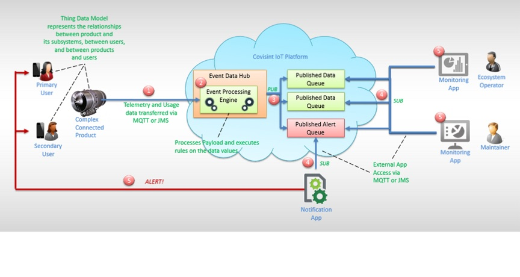

# IoT Product Overview

This Covisint IoT Platform release is built around Device Health Monitoring. Health Monitoring (HM) is the ability of the system to monitor key aspects of device functionality, and alert stakeholders (customers, users) to device behavior that could result in malfunction, and ultimately failure. This release will be followed by more releases based on more advanced use cases.

Health Monitoring provides proactive support by identifying and diagnosing potential faults and malfunctions, then contacting the affected stakeholders and directing them to solutions.

By monitoring the health of a connected device, Covisint's IoT Platform allows customers and users to mitigate and avoid operational risks, while increasing safety and reducing costs.

The diagram below shows how a complex connected product (thing) connects to the Covisint IoT Platform (cloud), then to an external operator/maintainer facing application to monitor the product’s health, or level of satisfactory functionality. The ecosystem operator/maintainer, or a notification application, then responds by sending an alert to the user, prompting attention to the connected product.

The technologies used to develop applications on this platform release include Java SDKs and ReST APIs (See APIs section).

