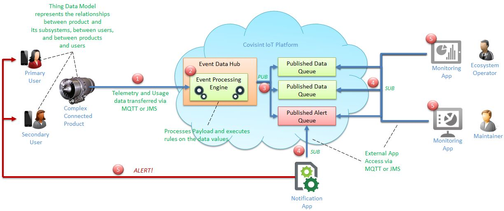

# Fleet Management Use Case
For a specific example of the health monitoring of connected products, let’s look at how the manager of a fleet of vehicles can monitor the health of individual vehicles.

**_For example:_**
--
1. Data about an event in a car (ex. temperature gauge shows overheating) is transferred via MQTT to an event data hub.
3. An event processing engine processes the data.
4. The data is published to an alert queue.
5. A notification application that is subscribed to the alert queue receives the alert.
7. The notification application sends an alert to the fleet support team.
8. The support team is then able to contact the driver and, with knowledge of the driver’s location relative to the nearest fleet outlet, direct the driver to go trade the car in for a new one.

**_The diagram below illustrates the data flow in a use case such as described above_**.

