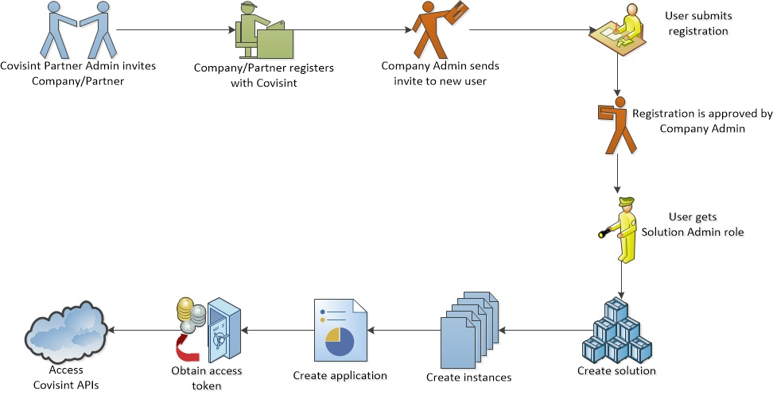

# Getting Started
This section provides information for Registration, Creating a Solution, Creating an Instance, Creating an Application, and the OAuth 2.0 authorization process. 
Registering is a very important step required to proceed to the portal and begin creating your own application. Creating a Solution will allow you to identify your project. Creating an Instance will grant access to the designated environment. Authorization to Covisint Micro-services is based on OAuth. Creating an application within the solution allows you to obtain your client credentials, which in turn is used to obtain access tokens. Once the application process is approved and complete, moving on to the Solution will be a smooth process. Each section is designed to assist and provide information as a tool guide. The standard process and procedures of each section gives details and references of the requirements to be implemented in order to create a solution, instance, and application.

This diagram demonstrates the overall standard view of the process for submitting an application and gaining access to Covisint Platform. As you can see from the diagram, there are a number of steps required  to gain access .  This section will provide additional detailed information on how to obtain access.

**_Typical workflow to gain access to Covisint APIs_**

