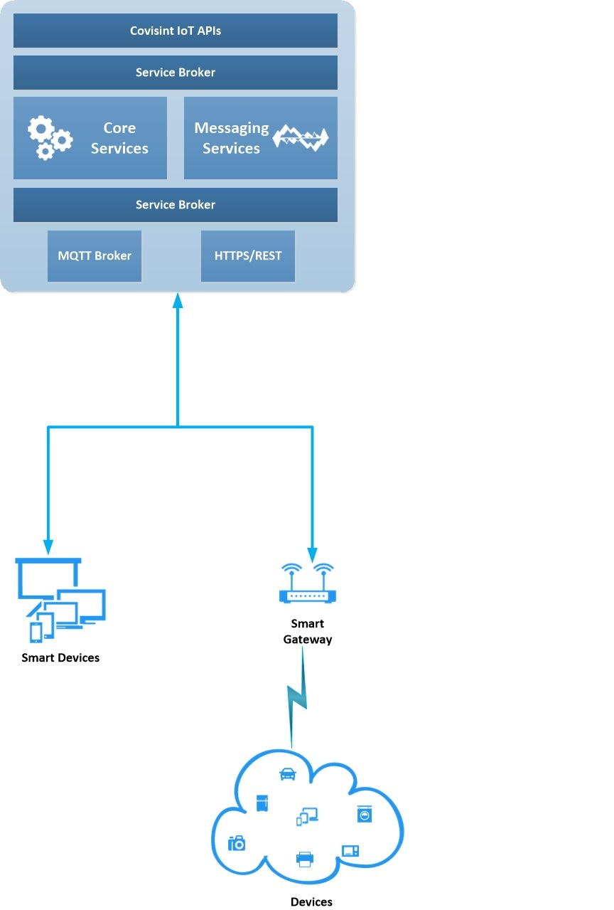

# IoT Platform Architecture

Covisint IoT Platform enables partners and solution developers to securely connect people, process and system of things. The platform provides identity relationship management and entitlement management services for users, devices and applications. Building applications is made easy with a rich set of APIs.

**_Solution developers can use Covisint IoT platform to perform the following tasks:_**
* Define Device Templates
* Create and manage Devices
* Define Events and Commands
* Create/Delete Applications
* Subscribe to Events from Devices
* Send Command/Event to Devices

**_The Platform consists of the following components:_**
* Core Services unit
* Messaging Services unit
* Service Broker
* MQTT Broker
* API Layer

A solution developer can model attributes, events, commands and device templates using Core Services. In addition, Core Services unit provides services for creating and managing devices and applications. The device attributes, events and commands are modeled in a generic fashion so that a library of these templates can be constructed. Using these templates, devices can be created and deleted on the fly and thereby providing more flexibility to the developer.

Devices can connect to the platform using MQTT protocol directly or through a Smart Gateway. The MQTT broker is based on scalable architecture which can connect to large number of devices and transport messages between the cloud and the devices. Service Broker help in routing the messages from the devices to applications and vice-versa. Developers can create routes and streams between devices and applications in Messaging Services unit. Applications can subscribe to events from the devices and send commands to devices. On the other hand, devices publish events and act on commands. All events and commands are tracked at a granular level inside the platform.

