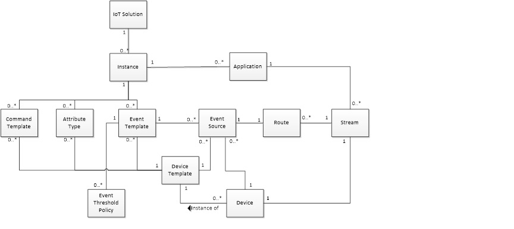

# **Domain Model**

## IoT Solution
IoT Solution is a logical grouping of related devices and applications.

## Instance
Instance is an application environment dedicated for a specific purpose.

## Application
Application refers to any external software.

## Device Template
Application refers to any external software.

## Attribute Type
Attribute Type describes the attributes or the properties of the device.

## Command Template
Command Template describes the format of the command that the end device can act on.

## Event Template
Event Template is used to model the format of the events that the device can emit.

## Event Threshold Policy
Event Threshold Policy describes a set of actions that need to be executed when certain conditions are met on a specified Event.

## Event Source
Event Threshold Policy describes a set of actions that need to be executed when certain conditions are met on a specified Event.

## Device
Device is an instance of a Device Template. It inherits the device properties, commands and events described in the template.

## Stream
Stream is a data pipe that transfers events and commands to/from devices.

## Route
Route identifies the producers and consumers of the event or command stream.

## Workflow
Workflow describes a set of actions that needs to be performed on events arriving from the device and before routing it to the desired destination.

